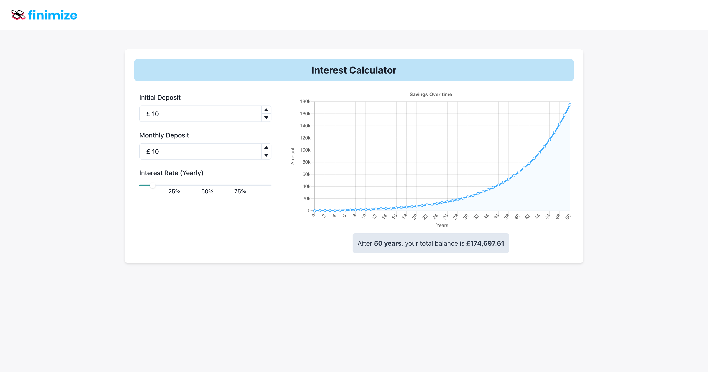
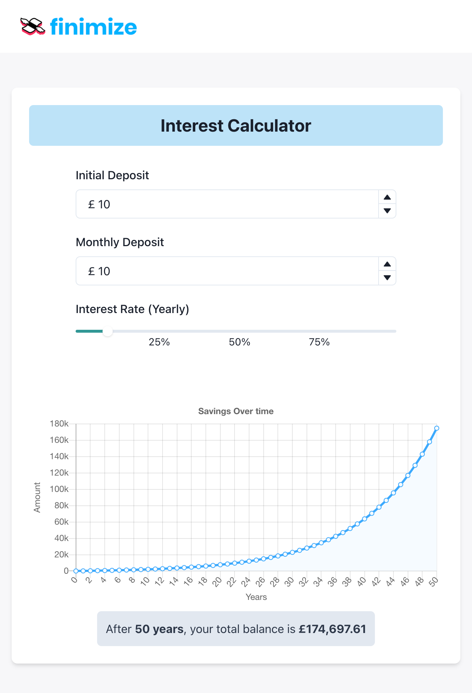

### General

-   I Tried to run it for the first time. I had to fix dependency issues by reinstalling yarn.lock and upgrading framer-motion.
-   I tried to understand how the formula works.
-   I tried to find best practices of how much decimal precision it needs to process in the backend and good user experience in the frontend.
-   I started from the backend first, then moved to the frontend.

### Backend

-   Created helper function to calculate yearly projections based on the specified input.
    I try my best to make the function scalable and dynamic enough to handle any requirements change in the future.
-   Used Django Rest Framework so the application would be scalable and easy to manage if the app gets big.
-   Added Unit Testing to the API

### Frontend

-   Fix the Container width to allow more content on the main page.
-   Create a typescript type.
-   Create an API service handler, so everything is modularised and in one place. Make it easier to debug.
-   Add input form for initial and monthly deposits and a slider for interest rate. An API call will be made every time there is a change to the input.
-   Integrate backend API with the input and the graph. Use state prop drilling to manage the state.

### Solution I love

-   Unit testing for the API.
-   The app is responsive.
-   I try my best to modularise the code, so it’s scalable and easier to manage if it gets big.
-   I also try to apply industry best practices to everything I do.

### Next Step

-   If I have more time, I would love to do more testing to the frontend using Jest and Cypress
    -   Carry out unit tests for each component using Jest
    -   Carry out end-to-end test using Cypress to ensure UI flow is what I expected it would be like
-   For now, I’m using prop drilling to manage state as the app only needs a simple prop drilling. However, I would love to implement redux if the app gets bigger.

### Screenshots

Picture 1

Picture 2

